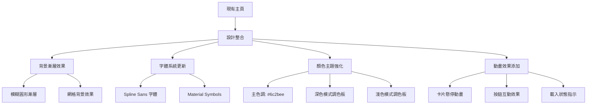

# 主頁設計整合計劃

## 目標
將「等待畫面」的視覺設計元素整合到現有主頁中，提升美觀度和使用者體驗。

## 現狀分析

### 現有主頁 (index.html)
- ✅ 已包含三個遊戲的跳轉連結
- ✅ 遊戲統計數據顯示（從 localStorage 讀取）
- ✅ 設置面板（音量控制、深色模式等）
- ✅ 響應式設計
- ⚠️ 視覺設計較為基礎

### 等待畫面設計元素
1. **漸層背景** - 模糊的圓形漸層效果
2. **現代字體** - Spline Sans 字體家族
3. **Material Symbols** - Google 圖標系統
4. **動畫效果** - 旋轉加載、脈衝動畫
5. **卡片設計** - 現代化邊框和陰影
6. **顏色主題** - 完整的深色/淺色模式支持

## 整合方案

### 1. 視覺設計升級


### 2. 技術實現步驟

#### 步驟 1: 引入外部資源
- 添加 Tailwind CSS CDN（用於快速樣式開發）
- 添加 Spline Sans 字體
- 添加 Material Symbols 圖標

#### 步驟 2: 更新 CSS 樣式
- 重構現有 CSS，加入等待畫面的設計元素
- 實現漸層背景效果
- 添加動畫關鍵幀

#### 步驟 3: 改進遊戲卡片
- 更新卡片設計，加入現代化陰影和邊框
- 添加懸停動畫效果
- 改善圖標顯示

#### 步驟 4: 強化深色/淺色模式
- 擴展現有深色模式功能
- 添加平滑的主題切換過渡
- 確保所有元素在兩種模式下都美觀

#### 步驟 5: 響應式設計優化
- 確保所有新設計在移動設備上表現良好
- 測試不同屏幕尺寸

### 3. 具體修改內容

#### 3.1 HTML 結構修改
```html
<!-- 添加字體和圖標資源 -->
<link href="https://fonts.googleapis.com/css2?family=Spline+Sans:wght@300;400;500;600;700&display=swap" rel="stylesheet">
<link href="https://fonts.googleapis.com/css2?family=Material+Symbols+Outlined:wght,FILL@100..700,0..1&display=swap" rel="stylesheet">

<!-- 添加背景漸層元素 -->
<div class="background-gradients">
  <div class="gradient-circle-1"></div>
  <div class="gradient-circle-2"></div>
  <div class="gradient-circle-3"></div>
</div>
```

#### 3.2 CSS 樣式更新
```css
/* 新的漸層背景效果 */
.gradient-circle {
  position: absolute;
  border-radius: 50%;
  filter: blur(80px);
  opacity: 0.15;
  z-index: 0;
}

/* 卡片懸停動畫 */
.game-card {
  transition: all 0.3s ease;
}

.game-card:hover {
  transform: translateY(-10px) scale(1.02);
  box-shadow: 0 20px 40px rgba(108, 43, 238, 0.2);
}

/* 深色/淺色模式變數 */
:root {
  --primary-color: #6c2bee;
  --background-light: #f6f6f8;
  --background-dark: #161022;
  --text-light: #333333;
  --text-dark: #ffffff;
}
```

#### 3.3 JavaScript 增強
- 擴展現有的 GameSettings 類，支持更完整的主題管理
- 添加平滑的主題切換動畫
- 優化遊戲統計數據的顯示

### 4. 預期成果

#### 視覺改善
1. **更現代的外觀** - 使用等待畫面的設計語言
2. **更好的視覺層次** - 通過漸層背景創造深度感
3. **流暢的動畫** - 提升使用者互動體驗
4. **一致的主題** - 深色/淺色模式無縫切換

#### 功能保持
1. **所有現有功能保留** - 遊戲跳轉、設置、統計數據
2. **性能不受影響** - 優化資源載入
3. **兼容性不變** - 支持所有現代瀏覽器

### 5. 實施時間線

```mermaid
gantt
    title 主頁整合實施時間線
    dateFormat  HH:mm
    axisFormat %H:%M
    
    section 準備階段
    分析設計元素      :done, 00:00, 10m
    制定整合方案      :done, 00:10, 10m
    
    section 實施階段
    CSS樣式重構      :active, 00:20, 20m
    遊戲卡片改進      :00:40, 20m
    深色模式強化      :01:00, 15m
    動畫效果添加      :01:15, 15m
    
    section 測試階段
    響應式測試        :01:30, 15m
    功能測試          :01:45, 15m
    性能優化          :02:00, 10m
```



### 6. 風險與緩解措施

| 風險 | 影響 | 緩解措施 |
|------|------|----------|
| 設計風格不統一 | 中等 | 建立設計系統，確保顏色、間距、字體一致 |
| 性能下降 | 低 | 優化CSS，減少不必要的動畫，使用硬體加速 |
| 瀏覽器兼容性問題 | 低 | 使用漸進增強，提供降級方案 |
| 現有功能受影響 | 中等 | 充分測試，確保所有跳轉和設置功能正常 |

## 結論

這個整合計劃將顯著提升主頁的視覺吸引力，同時保持所有現有功能完整。通過導入等待畫面的現代設計元素，我們可以創造一個更專業、更吸引人的遊戲中心介面。

**下一步**：請確認這個計劃，然後我們可以切換到 Code 模式開始實施。